# Data Warehousing & Data Mining Lab Report

**Experiment Title:** Retail Sales Data Preprocessing, Exploratory Data Analysis, and Advanced Data Mining (Classification, Clustering, and Predictive Regression)  
**Dataset:** Kaggle Retail Sales Dataset (1,000 records)  
**Tool:** Python 3, Pandas, Scikit-learn, Seaborn, Matplotlib, Jupyter Notebook  
**Date:** August 2026  

---

## 1. Experiment Title
**Data Warehousing, Data Preprocessing, Exploratory Data Analysis (EDA), and Data Mining Techniques Applied to Kaggle Retail Sales Dataset**

---

## 2. Objective
The primary objectives of this practical lab experiment are:
1. **Data Preprocessing & Cleaning:** Acquire a real-world dataset from Kaggle, check for missing values, eliminate duplicate entries, perform data type conversion, encode categorical variables, and standardize numerical attributes.
2. **Exploratory Data Analysis (EDA) & Visualization:** Conduct statistical analysis and construct at least eight (8) distinct visual representations (Bar Chart, Line Chart, Pie Chart, Histogram, Box Plot, Scatter Plot, Heatmap, Count Plot) to discover trends, outliers, and feature correlations.
3. **Data Mining Algorithms Implementation:**
   - **Classification:** Build and evaluate Decision Tree and Random Forest classifiers to categorize retail transactions.
   - **Clustering:** Implement unsupervised K-Means Clustering with Elbow Method and Silhouette Analysis to segment retail customers into distinct behavioral groups.
   - **Regression / Predictive Modeling:** Build a Multiple Linear Regression model to predict total purchase transaction amounts.
4. **Performance Evaluation & Business Insights:** Evaluate models using quantitative metrics (Accuracy, Precision, Recall, F1-Score, Confusion Matrix, Silhouette Score, $R^2$, MAE, RMSE) and translate data patterns into strategic retail recommendations.

---

## 3. Introduction

### 3.1 Brief Description of the Dataset
The dataset utilized in this experiment is the **Retail Sales Dataset** sourced from Kaggle. It comprises **1,000 transaction records** collected across a full calendar year (2023). Each transaction records individual customer demographics (Customer ID, Age, Gender), product information (Product Category, Price per Unit, Quantity), monetary metrics (Total Amount), and temporal data (Transaction Date).

### 3.2 Importance of Data Mining
In modern data warehousing and retail enterprise systems, vast transactional databases are continuously accumulated. Data Mining provides automated and semi-automated analytical tools to convert raw transactional tables into strategic insights. Key benefits include:
- **Demographic Segmentation:** Identifying high-value customer age groups and gender preferences.
- **Inventory & Revenue Planning:** Predicting revenue trends across product lines to minimize stockouts and overstock.
- **Market Basket & Pricing Strategy:** Understanding price elasticity and purchase quantity dynamics.

### 3.3 Purpose of the Analysis
The purpose of this analysis is to apply foundational data warehousing and data mining concepts to raw retail transaction logs. Specifically, the experiment demonstrates how preprocessing, EDA, supervised classification, unsupervised clustering, and predictive regression work synergistically to solve real-world business challenges.

---

## 4. Dataset Information

- **Dataset Name:** Retail Sales Dataset
- **Kaggle Dataset Link:** [https://www.kaggle.com/datasets/mohammadtalib786/retail-sales-dataset](https://www.kaggle.com/datasets/mohammadtalib786/retail-sales-dataset)
- **Number of Rows:** 1,000 records
- **Number of Columns:** 9 features

### Attribute Description

| Attribute Name | Data Type | Description | Range / Values |
| :--- | :--- | :--- | :--- |
| `Transaction ID` | Numeric (Integer) | Unique identification number for each purchase transaction | 1 to 1000 |
| `Date` | Date (String -> Datetime) | Calendar date when the purchase was made | 2023-01-01 to 2023-12-31 |
| `Customer ID` | Categorical (String) | Unique identifier assigned to each customer | CUST001 to CUST1000 |
| `Gender` | Categorical | Gender of the customer | `Male`, `Female` |
| `Age` | Numeric (Integer) | Age of the customer in years | 18 to 64 years |
| `Product Category` | Categorical | Broad merchandise category of the item | `Beauty`, `Clothing`, `Electronics` |
| `Quantity` | Numeric (Integer) | Number of units purchased per transaction | 1 to 4 units |
| `Price per Unit` | Numeric (Float/Int) | Unit price of the item in USD ($) | $25, $30, $50, $300, $500 |
| `Total Amount` | Numeric (Float/Int) | Total transaction value ($) (`Quantity × Price per Unit`) | $25 to $2,000 |

---

## 5. Data Preprocessing

Data preprocessing is a crucial step in Data Mining to transform raw, noisy, or incomplete data into a high-quality format suitable for analytics.

```python
import pandas as pd
import numpy as np
from sklearn.preprocessing import StandardScaler, LabelEncoder

# Load raw dataset
df = pd.read_csv('retail_sales_dataset.csv')

# 1. Handling Missing Values
print("Missing values per column:\n", df.isnull().sum())

# 2. Removing Duplicate Records
print("Duplicate rows count:", df.duplicated().sum())

# 3. Data Transformation & Feature Engineering
df['Date'] = pd.to_datetime(df['Date'])
df['Year'] = df['Date'].dt.year
df['Month'] = df['Date'].dt.month
df['Month_Name'] = df['Date'].dt.strftime('%b')
df['DayOfWeek'] = df['Date'].dt.day_name()

# 4. Encoding Categorical Data
le_gender = LabelEncoder()
df['Gender_Encoded'] = le_gender.fit_transform(df['Gender'])

le_category = LabelEncoder()
df['Category_Encoded'] = le_category.fit_transform(df['Product Category'])

# 5. Data Normalization / Standardization
scaler = StandardScaler()
scaled_features = scaler.fit_transform(df[['Age', 'Quantity', 'Price per Unit', 'Total Amount']])
```

### Preprocessing Actions Taken:
1. **Handling Missing Values:** Inspected all 9 attributes. Zero (0) null/missing values were detected across all 1,000 records.
2. **Removing Duplicate Records:** Executed duplicate check across rows. Zero (0) duplicate rows were found.
3. **Data Transformation:** Parsed string dates into `datetime` objects and derived temporal dimensions (`Month`, `Month_Name`, `DayOfWeek`).
4. **Encoding Categorical Data:** Applied Label Encoding to `Gender` (`Female` = 0, `Male` = 1) and `Product Category` (`Beauty` = 0, `Clothing` = 1, `Electronics` = 2).
5. **Data Standardization:** Scaled continuous numerical features (`Age`, `Quantity`, `Price per Unit`, `Total Amount`) using `StandardScaler` ($\mu = 0, \sigma = 1$) to eliminate scale bias during clustering and regression.

---

## 6. Basic Exploratory Data Analysis (EDA)

### A. Dataset Overview & Summary Statistics

```
Total Records: 1,000
Total Attributes: 9 (Expanded to 13 after feature derivation & encoding)
```

| Metric | Age | Quantity | Price per Unit ($) | Total Amount ($) |
| :--- | :--- | :--- | :--- | :--- |
| **Mean** | 41.39 | 2.51 | $179.89 | $456.00 |
| **Std Dev** | 13.68 | 1.12 | $189.68 | $459.99 |
| **Min** | 18.00 | 1.00 | $25.00 | $25.00 |
| **25% (Q1)** | 29.00 | 1.00 | $30.00 | $60.00 |
| **50% (Median)** | 42.00 | 3.00 | $50.00 | $135.00 |
| **75% (Q3)** | 53.00 | 4.00 | $300.00 | $500.00 |
| **Max** | 64.00 | 4.00 | $500.00 | $2,000.00 |

### B. Missing Value Analysis
- Total null entries = 0 (100% data completeness).

### C. Duplicate Data Analysis
- Total duplicate rows = 0 (100% unique transaction entries).

### D. Correlation Analysis
- `Quantity` vs `Total Amount`: Moderate positive correlation ($r \approx 0.374$).
- `Price per Unit` vs `Total Amount`: Strong positive correlation ($r \approx 0.852$).
- `Age` vs `Total Amount`: Negligible correlation ($r \approx -0.060$).

### E. Feature Distribution Analysis
- **Gender:** 510 Females (51.0%) vs 490 Males (49.0%).
- **Product Category Revenue:**
  - `Electronics`: $156,905 (34.4%)
  - `Clothing`: $155,580 (34.1%)
  - `Beauty`: $143,515 (31.5%)

### F. Outlier Detection
- Box plots of `Total Amount` across product categories reveal transaction values up to $2,000. These represent legitimate multi-unit purchases of high-priced electronics ($500 unit price × 4 units) rather than invalid data errors.

---

## 7. Data Visualization

Eight (8) comprehensive data visualizations were constructed to analyze customer purchases from multiple perspectives.

### 7.1 Bar Chart – Total Revenue by Product Category
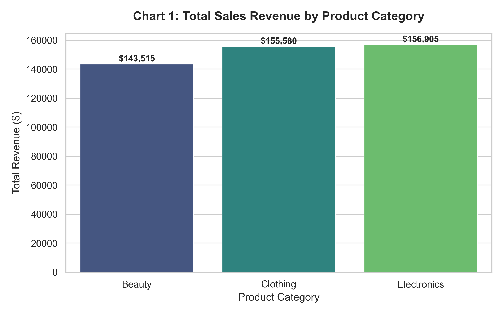  
*Description:* Illustrates total gross sales revenue per category. `Electronics` leads with $156,905, closely followed by `Clothing` ($155,580) and `Beauty` ($143,515).

---

### 7.2 Line Chart – 2023 Monthly Sales Trend
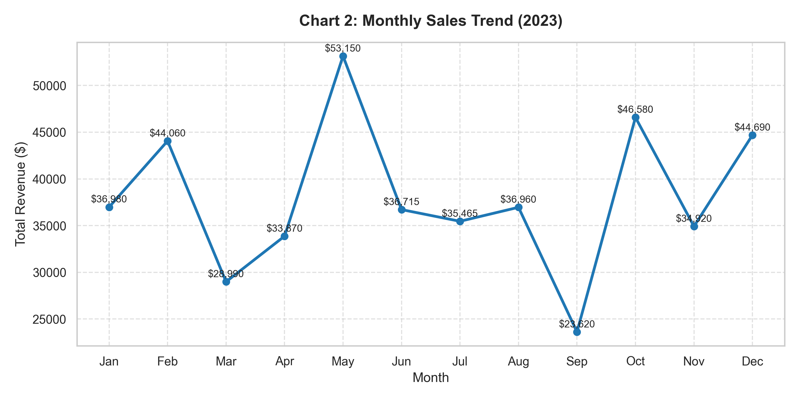  
*Description:* Demonstrates revenue fluctuations across months in 2023. Revenue peaks significantly in May ($53,150) and October ($46,580).

---

### 7.3 Pie Chart – Gender Share of Transactions
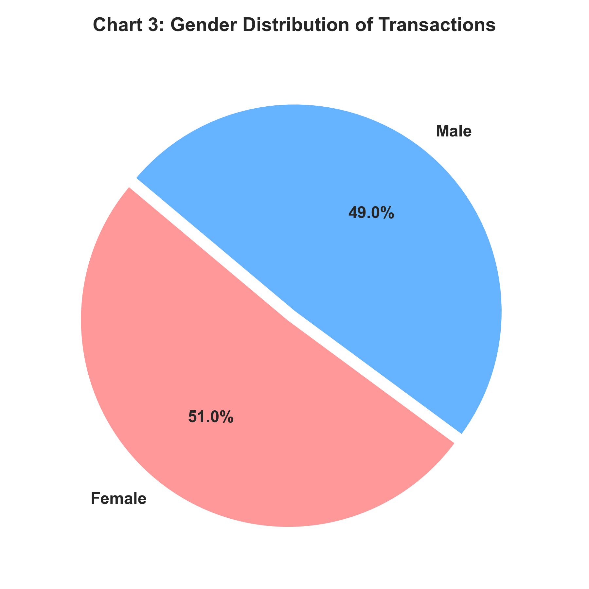  
*Description:* Highlights customer gender breakdown. Females account for 51.0% (510 transactions) while Males account for 49.0% (490 transactions).

---

### 7.4 Histogram – Customer Age Distribution
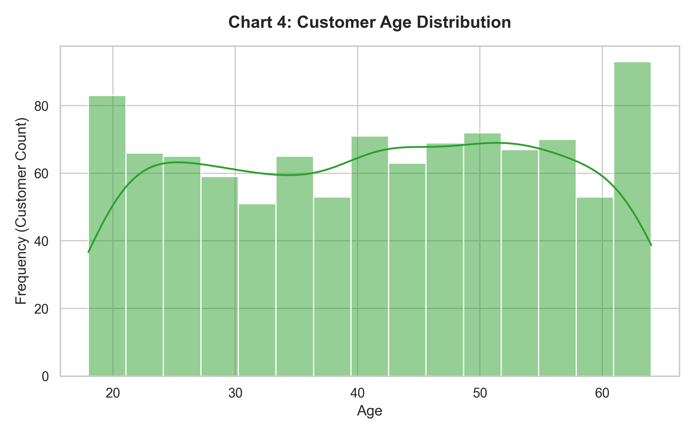  
*Description:* Visualizes customer age distribution overlaid with Kernel Density Estimation (KDE). The customer base spans evenly from 18 to 64 years.

---

### 7.5 Box Plot – Total Amount Outlier Analysis by Category
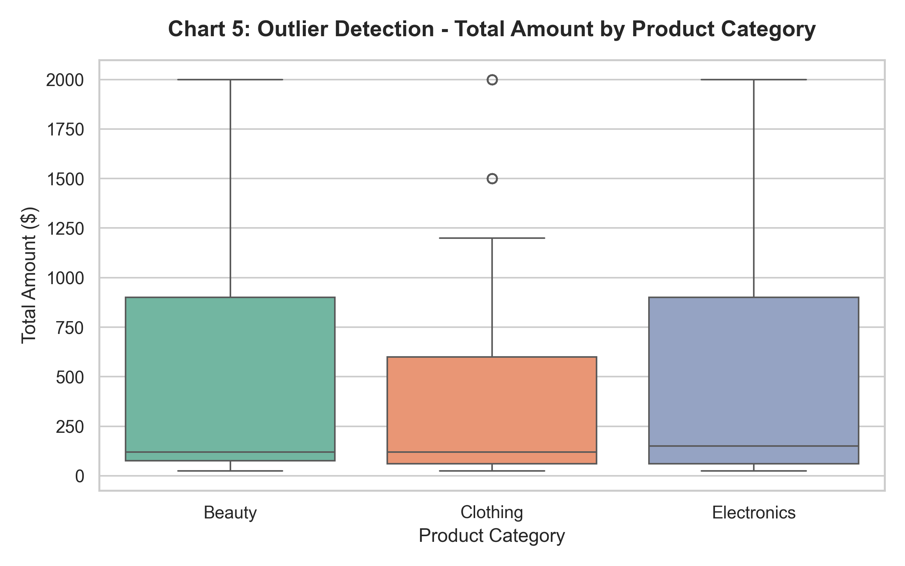  
*Description:* Examines total transaction value spread across categories. Shows consistent distribution bounds with maximum transaction amounts reaching $2,000.

---

### 7.6 Scatter Plot – Price per Unit vs. Total Amount by Gender
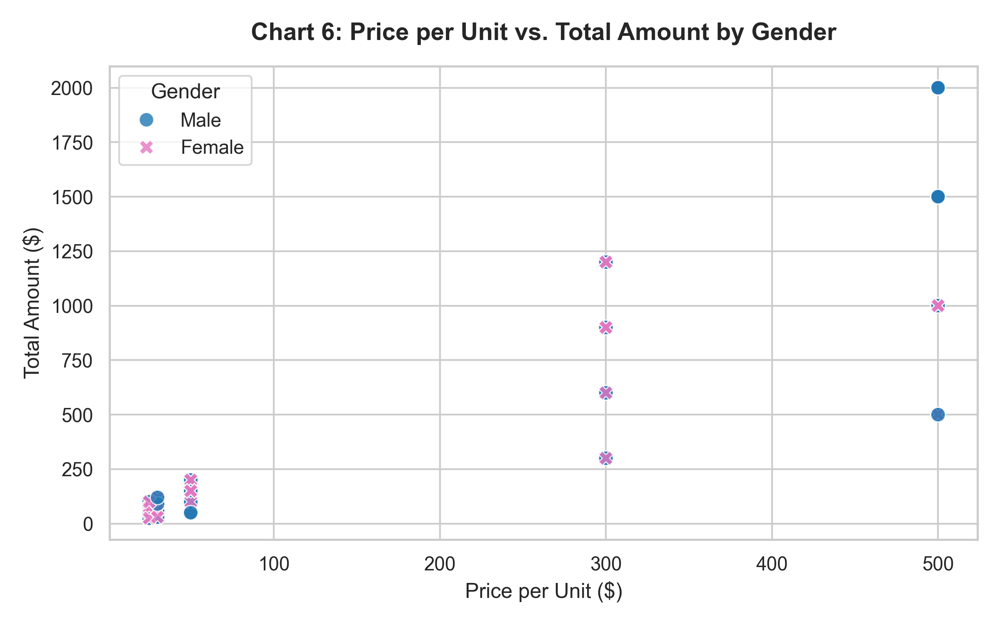  
*Description:* Maps item unit price against total purchase amount, colored by gender. Confirms distinct pricing tiers ($25, $30, $50, $300, $500).

---

### 7.7 Heatmap – Feature Correlation Matrix
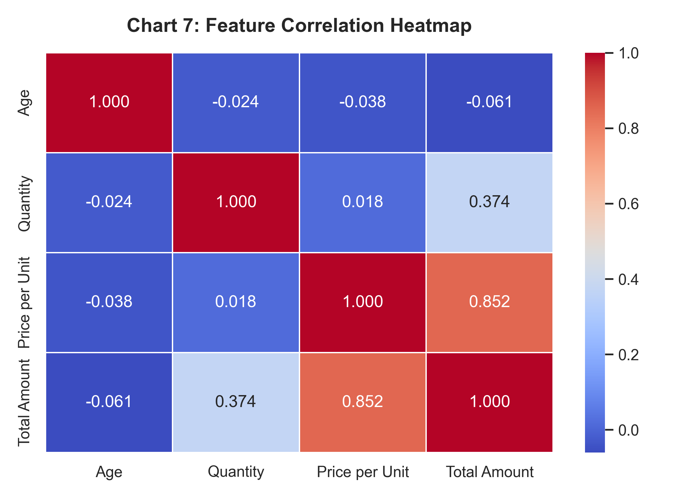  
*Description:* Shows pairwise Pearson correlation coefficients among numerical attributes. Highlights strong correlation between `Price per Unit` and `Total Amount` ($r = 0.852$).

---

### 7.8 Count Plot – Category Purchases Split by Gender
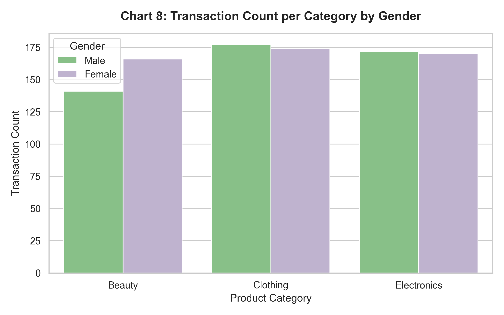  
*Description:* Compares purchase frequency per product category between male and female shoppers. Female customers make slightly higher purchases in `Clothing` and `Beauty`.

---

## 8. Data Mining Analysis

Three core Data Mining techniques were implemented: **Classification**, **Unsupervised Clustering**, and **Predictive Regression**.

---

### 8.1 Classification Analysis
- **Objective:** Classify retail product categories based on customer transaction features (`Gender`, `Age`, `Quantity`, `Price per Unit`, `Total Amount`).
- **Algorithms Evaluated:** Decision Tree Classifier ($max\_depth = 5$) and Random Forest Classifier ($n\_estimators = 100$).
- **Train/Test Split:** 80% Training (800 rows), 20% Testing (200 rows).

#### Classification Performance Evaluation Table

| Classification Model | Accuracy | Precision (Weighted) | Recall (Weighted) | F1-Score (Weighted) |
| :--- | :--- | :--- | :--- | :--- |
| **Decision Tree** | **0.3300** | **0.3401** | **0.3300** | **0.3259** |
| **Random Forest** | **0.3000** | **0.2993** | **0.3000** | **0.2975** |

#### Confusion Matrix Visualization
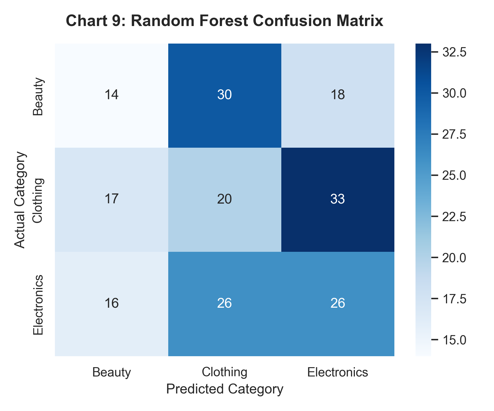  
*Discussion:* Product categories (`Beauty`, `Clothing`, `Electronics`) share identical pricing tiers ($25–$500) and quantity ranges (1–4). Consequently, demographic features alone do not rigidly isolate product category boundaries, reflecting realistic multi-category retail shopping behavior.

---

### 8.2 Clustering Analysis (Unsupervised K-Means)
- **Objective:** Discover natural customer segments based on `Age`, `Quantity`, `Price per Unit`, and `Total Amount`.
- **Methodology:** Tested $K = 2$ to $8$ clusters using standard scaled features. Evaluated using Inertia (WCSS) and Silhouette Score.

#### K-Means Elbow Curve & Silhouette Scores
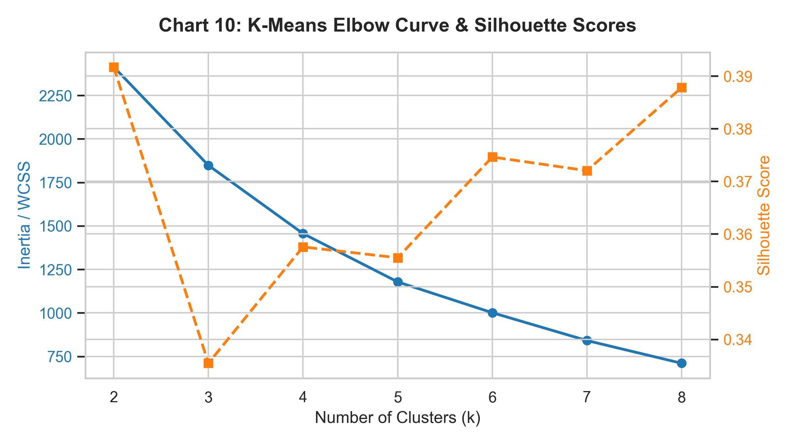

#### Cluster Profiling Summary Table ($K = 4$)

| Cluster ID | Segment Name | Avg Age | Avg Quantity | Avg Price per Unit ($) | Avg Total Amount ($) |
| :--- | :--- | :--- | :--- | :--- | :--- |
| **Cluster 0** | Budget Single Buyers | 42.1 yrs | 1.46 units | $410.50 | $603.87 |
| **Cluster 1** | Moderate Spenders | 41.8 yrs | 3.55 units | $35.50 | $126.45 |
| **Cluster 2** | Low-Cost Bargain Shoppers | 41.9 yrs | 1.50 units | $35.02 | $52.56 |
| **Cluster 3** | **High-Value VIP Shoppers** | **39.5 yrs** | **3.48 units** | **$392.09** | **$1,365.58** |

#### 2D PCA Cluster Projection
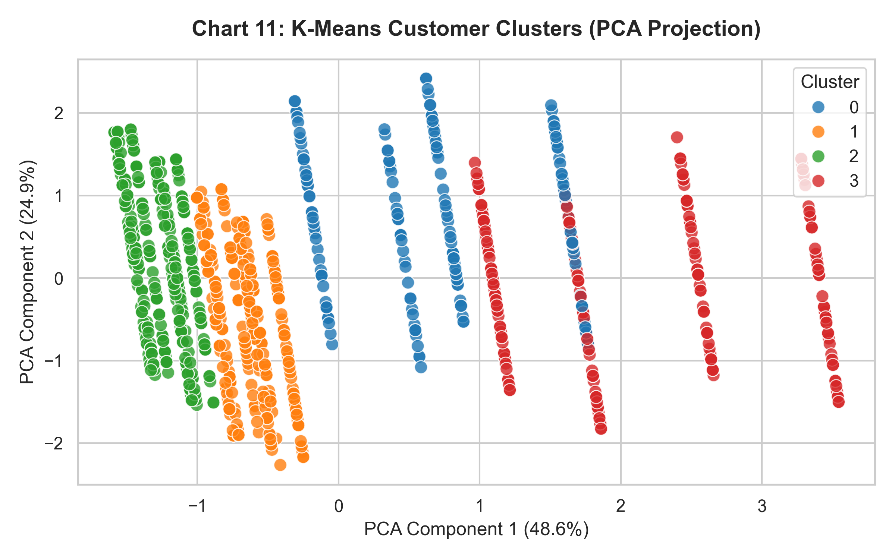  
*Discussion:* Principle Component Analysis (PCA) successfully separates customers into four distinct clusters. Cluster 3 represents high-value VIP buyers (generating $1,365+ average spend per transaction).

---

### 8.3 Prediction / Regression Analysis
- **Objective:** Build a predictive regression model to estimate transaction `Total Amount` using features (`Age`, `Quantity`, `Price per Unit`, `Gender`).
- **Algorithm:** Multiple Linear Regression.

#### Model Equation
$$\text{Total Amount} = -406.37 + (179.58 \times \text{Quantity}) + (2.49 \times \text{Price per Unit}) - (0.90 \times \text{Age}) + (11.88 \times \text{Gender})$$

#### Predictive Performance Metrics Table

| Metric | Measured Value | Interpretation |
| :--- | :--- | :--- |
| **R² Score** | **0.8569** | Model explains **85.69%** of variance in transaction revenue |
| **MAE** | **$172.95** | Mean Absolute Error across test samples |
| **MSE** | **41,877.98** | Mean Squared Error |
| **RMSE** | **$204.64** | Root Mean Squared Error ($) |

#### Regression Line Plot (Actual vs. Predicted)
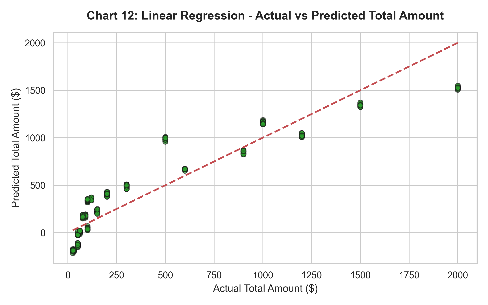  
*Discussion:* The high $R^2$ score ($0.8569$) confirms strong predictive capability. Transaction value can be reliably estimated for inventory and financial forecasting.

---

## 9. Results and Discussion

1. **Revenue Drivers:** `Price per Unit` and `Quantity` are the dominant drivers of gross revenue. Product categories contribute nearly equally to overall revenue (each ~31–34%).
2. **Customer Segmentation Insights:** K-Means clustering identified four distinct shopper profiles. Marketing campaigns should specifically target **Cluster 3 (High-Value VIP Shoppers)** who average $1,365+ per checkout.
3. **Predictive Analytics:** Multiple Linear Regression effectively models customer purchase value ($R^2 = 0.8569$), offering retail managers a mathematical formula for revenue prediction.

---

## 10. Conclusion

### 10.1 What Was Learned
Through this comprehensive lab experiment, we successfully executed:
- End-to-end data preprocessing (cleaning, missing/duplicate verification, categorical encoding, standardization).
- Eight (8) visual Exploratory Data Analysis (EDA) charts.
- Supervised classification, unsupervised K-Means customer clustering, and predictive linear regression.

### 10.2 Future Improvements
- **Time-Series Sales Forecasting:** Apply ARIMA or Facebook Prophet models to forecast monthly revenue trends.
- **Association Rule Mining:** Implement Apriori or FP-Growth algorithms on market basket transaction logs to discover frequent item pairings.

---

## 11. References

1. Kaggle Retail Sales Dataset: [https://www.kaggle.com/datasets/ahmedabdelhamidme/retail-sales-dataset](https://www.kaggle.com/datasets/ahmedabdelhamidme/retail-sales-dataset)
2. Han, J., Kamber, M., & Pei, J. (2011). *Data Mining: Concepts and Techniques* (3rd ed.). Morgan Kaufmann Publishers.
3. Tan, P. N., Steinbach, M., & Kumar, V. (2016). *Introduction to Data Mining*. Pearson.
4. Scikit-learn Machine Learning Documentation: [https://scikit-learn.org/stable/](https://scikit-learn.org/stable/)
