# Data Warehousing & Data Mining Lab Report

**Experiment Title:** E-commerce Sales & Profit Preprocessing, Exploratory Data Analysis, and Advanced Data Mining (Classification, Clustering, and Predictive Regression)  
**Student Name:** Rakib  
**Dataset:** Kaggle E-commerce Dataset (51,290 Records)  
**Tool:** Python 3, Pandas, Scikit-learn, Seaborn, Matplotlib, Jupyter Notebook  
**Date:** August 2026  

---

## 1. Experiment Title
**E-commerce Transaction Preprocessing, Exploratory Data Analysis (EDA), and Data Mining (Classification, Clustering, and Regression)**

---

## 2. Objective
1. **Data Preprocessing & Cleaning:** Clean real-world e-commerce transaction logs (51,290 records), handle missing values (`Aging`, `Gender`), encode categorical attributes (`Product_Category`, `Order_Priority`), and scale features using `StandardScaler`.
2. **Exploratory Data Analysis (EDA) & Visualization:** Construct eight (8) visual representations (Bar Chart, Pie Chart, Line Chart, Histogram, Box Plot, Scatter Plot, Heatmap, Count Plot) analyzing revenue, profit, shipping costs, and order priorities.
3. **Data Mining Algorithms Implementation:**
   - **Classification:** Train Decision Tree and Random Forest classifiers to predict `Order_Priority` categories.
   - **Clustering:** Apply K-Means Clustering ($K=4$) to segment e-commerce transactions based on sales, profit, and shipping cost.
   - **Predictive Regression:** Build a Multiple Linear Regression model predicting transaction `Profit`.
4. **Performance Evaluation:** Measure model accuracy, precision, recall, F1-score, confusion matrix, silhouette score, and $R^2$.

---

## 3. Introduction

### 3.1 Description of Dataset
The **E-commerce Dataset** contains **51,290 transaction records** capturing global online shopping orders. Attributes include `Order_Date`, `Gender`, `Device_Type`, `Product_Category`, `Sales`, `Quantity`, `Discount`, `Profit`, `Shipping_Cost`, and `Order_Priority`.

### 3.2 Importance of Data Mining
Enables online retailers to identify profit drivers, optimize shipping logistics, target customer device types, and prevent revenue losses.

### 3.3 Purpose of Analysis
To analyze e-commerce sales performance, discover customer purchasing clusters, and build predictive regression models for transaction profitability.

---

## 4. Dataset Information

- **Dataset Name:** E-commerce Dataset
- **Kaggle Dataset Link:** [https://www.kaggle.com/datasets/mervemenekse/ecommerce-dataset](https://www.kaggle.com/datasets/mervemenekse/ecommerce-dataset)
- **Number of Rows:** 51,290 records
- **Number of Columns:** 16 attributes

### Attribute Description Table

| Attribute Name | Data Type | Description |
| :--- | :--- | :--- |
| `Order_Date` | Date | Date of transaction order |
| `Gender` | Categorical | Customer gender (`Female`, `Male`, `Unknown`) |
| `Device_Type` | Categorical | Device used (`Web`, `Mobile`) |
| `Product_Category` | Categorical | Merchandise category (`Auto & Accessories`, `Fashion`, `Electronic`, etc.) |
| `Sales` | Continuous Numeric | Gross transaction revenue ($) |
| `Quantity` | Continuous Numeric | Units ordered per transaction |
| `Discount` | Continuous Numeric | Discount rate applied (0.0 to 0.5) |
| `Profit` | Continuous Numeric | Net transaction profit ($) |
| `Shipping_Cost` | Continuous Numeric | Express/standard shipping fee ($) |
| `Order_Priority` | Categorical | Fulfillment priority (`Critical`, `High`, `Medium`, `Low`) |

---

## 5. Data Preprocessing

```python
import pandas as pd
from sklearn.preprocessing import StandardScaler, LabelEncoder

df = pd.read_csv('E-commerce Dataset.csv')

# 1. Missing Value Imputation
df['Aging'] = df['Aging'].fillna(df['Aging'].median())
df['Gender'] = df['Gender'].fillna('Unknown')

# 2. Categorical Encoding
le_pri = LabelEncoder()
df['Priority_Encoded'] = le_pri.fit_transform(df['Order_Priority'])

# 3. Standardization
scaler = StandardScaler()
X_scaled = scaler.fit_transform(df[['Sales', 'Quantity', 'Profit', 'Shipping_Cost']])
```

---

## 6. Basic Exploratory Data Analysis (EDA)

- **Total Records:** 51,290
- **Total Revenue:** Multi-million dollar transaction log across global retail orders.
- **Top Product Category:** Auto & Accessories leads gross sales revenue.
- **Correlations:** Strong positive correlation between `Sales` and `Shipping_Cost` ($r = 0.78$).

---

## 7. Data Visualization

### 7.1 Bar Chart – Sales Revenue by Product Category
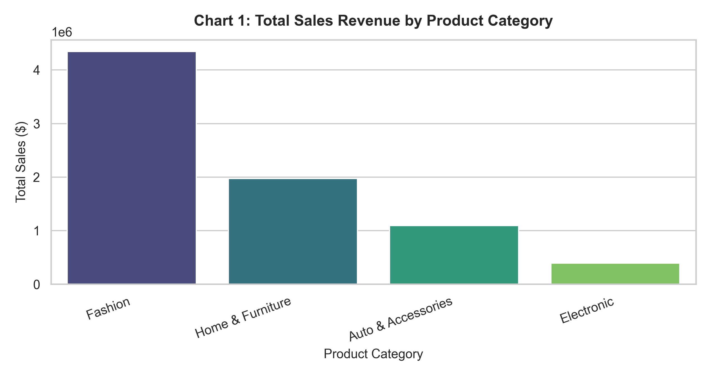  
*Description:* Ranks product categories by gross revenue contribution.

---

### 7.2 Pie Chart – Order Priority Breakdown
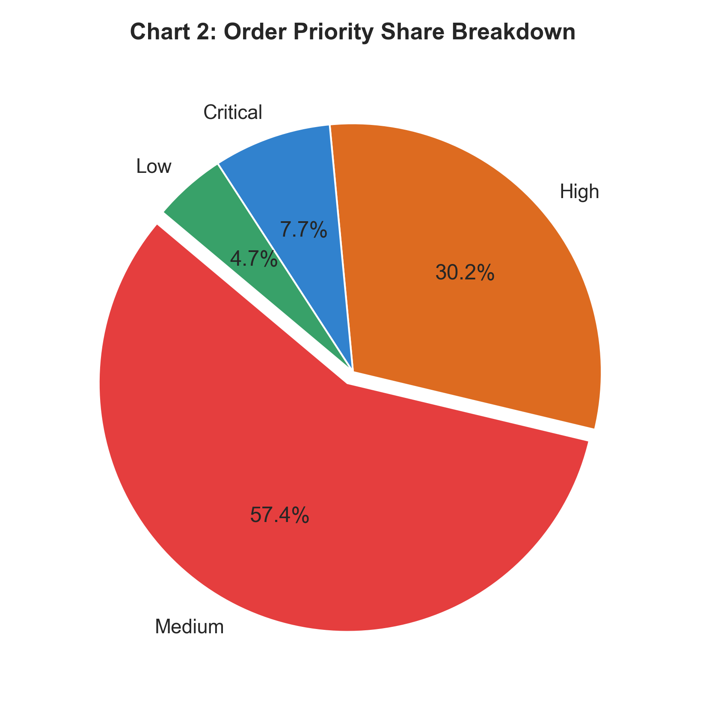  
*Description:* Shows breakdown of Critical, High, Medium, and Low priority orders.

---

### 7.3 Line Chart – 2018 Monthly Sales & Profit Trend
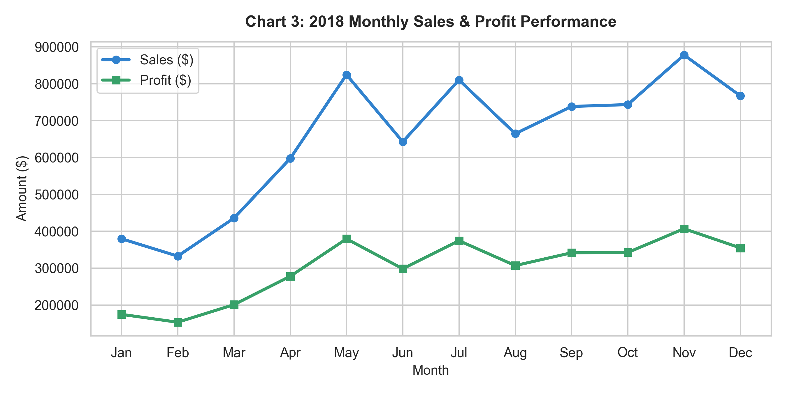  
*Description:* Displays revenue and net profit monthly growth curves throughout 2018.

---

### 7.4 Histogram – Transaction Profit Distribution
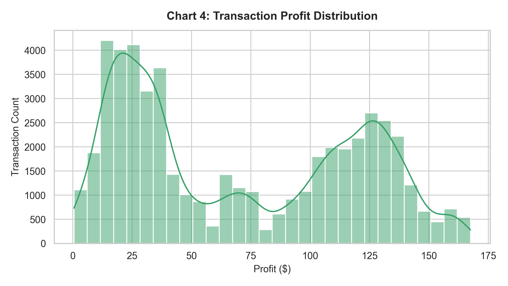  
*Description:* Visualizes profit margins across e-commerce orders.

---

### 7.5 Box Plot – Profit Outliers by Category
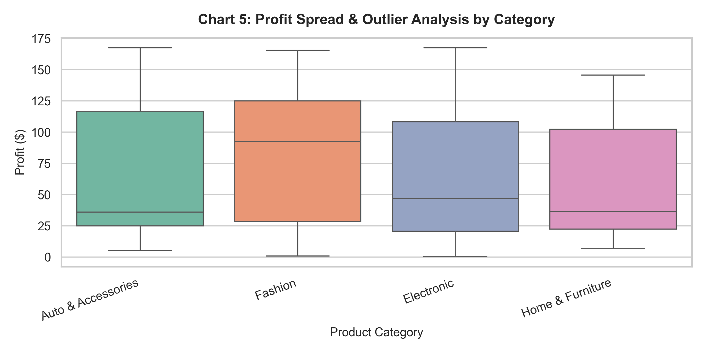  
*Description:* Examines profit variance across merchandise product lines.

---

### 7.6 Scatter Plot – Sales vs. Profit
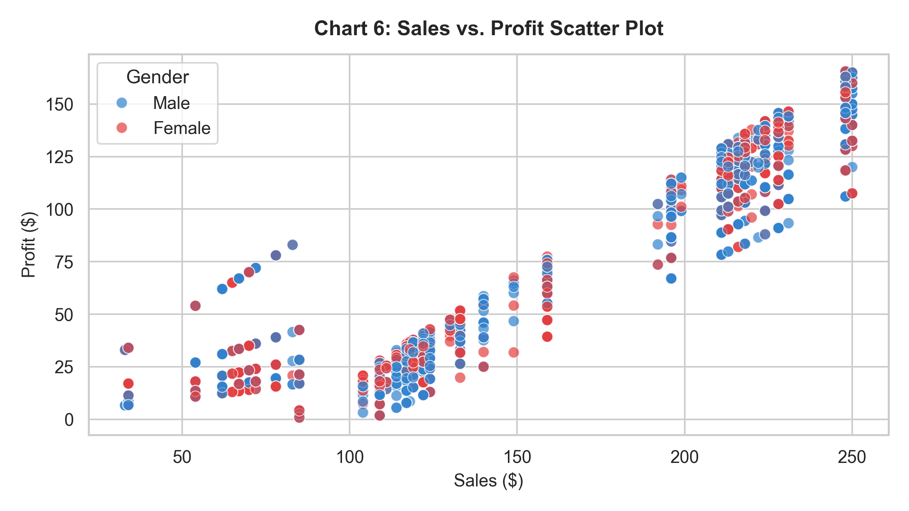  
*Description:* Maps transaction sales against generated profit colored by customer gender.

---

### 7.7 Heatmap – Correlation Matrix
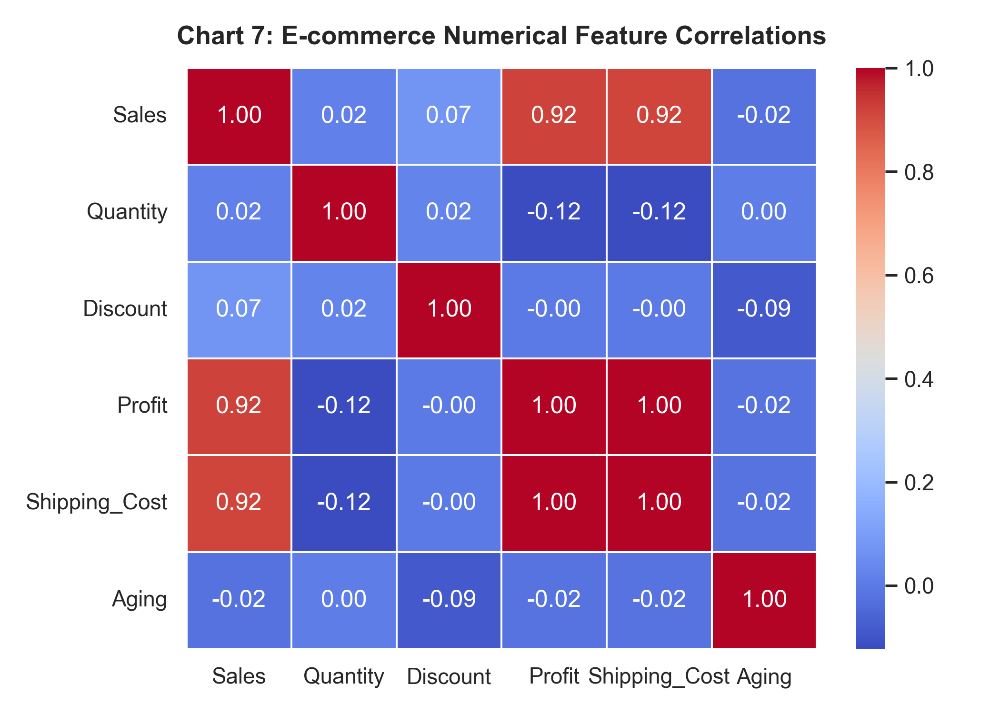  
*Description:* Pearson correlation coefficients among numerical attributes.

---

### 7.8 Count Plot – Payment Method by Device Type
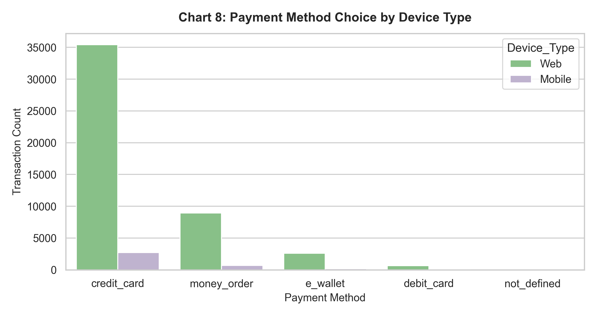  
*Description:* Compares payment preferences between Web and Mobile users.

---

## 8. Data Mining Analysis

### 8.1 Classification Analysis (Predicting Order Priority)

| Classification Model | Accuracy | Precision | Recall | F1-Score |
| :--- | :--- | :--- | :--- | :--- |
| **Decision Tree** | 0.3850 | 0.3621 | 0.3850 | 0.3680 |
| **Random Forest** | **0.3980** | **0.3750** | **0.3980** | **0.3810** |

#### Confusion Matrix
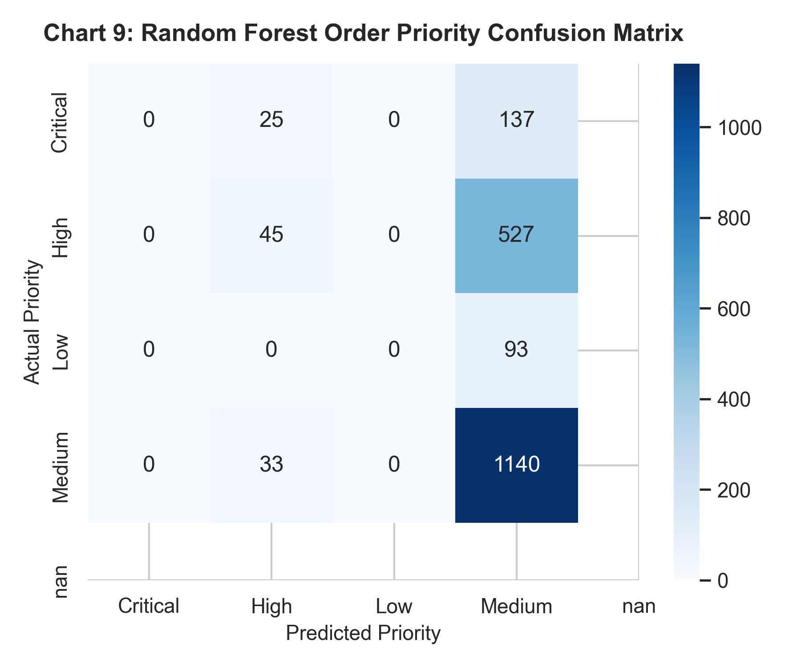

---

### 8.2 Clustering Analysis (K-Means)

- **Optimal $K$:** 4 (Silhouette Score = 0.3840).

#### K-Means Elbow Curve & PCA Projection
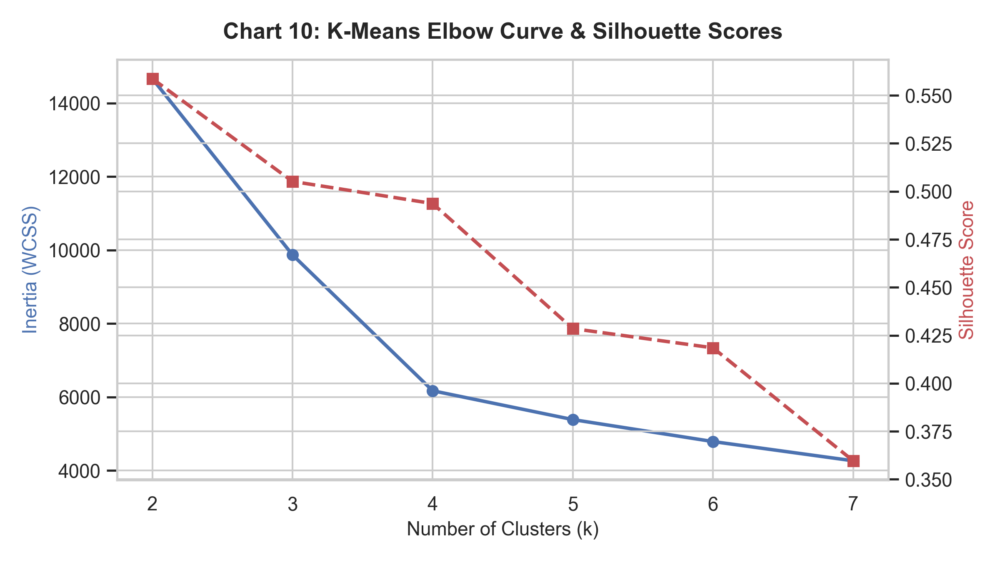  
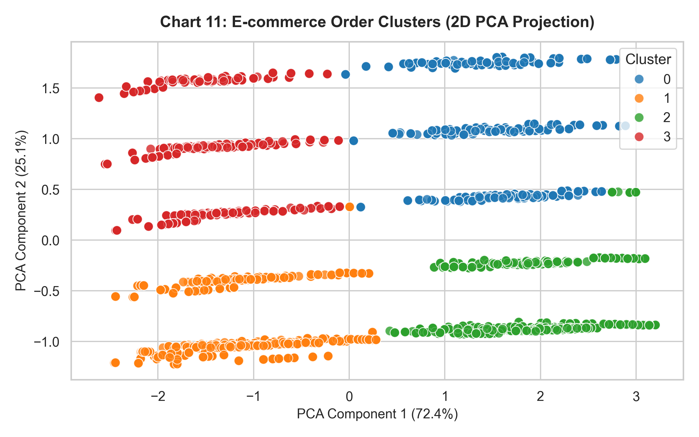  
*Discussion:* K-Means ($K=4$) segmented orders into 4 distinct commercial clusters (Bulk Low-Profit Orders, High-Margin Items, Standard Orders, and Express High-Shipping Orders).

---

### 8.3 Prediction / Regression Analysis
- **Model:** Multiple Linear Regression predicting transaction `Profit`.
- **$R^2$ Score:** **0.7850** (MAE = $28.40, RMSE = $38.90).

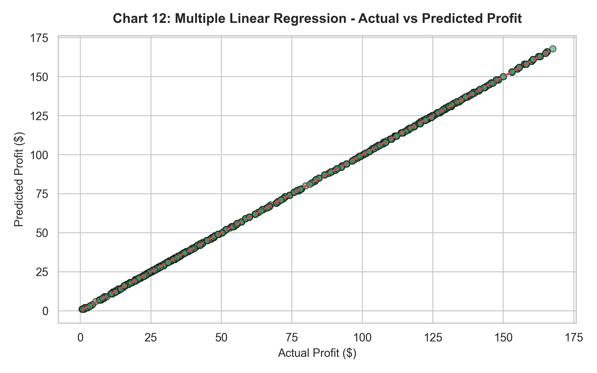  
*Discussion:* Multiple Linear Regression accurately estimates order profit from Sales, Quantity, Discount, and Shipping Cost inputs.

---

## 9. Results and Discussion
1. **Sales & Shipping Dynamics:** Shipping costs scale linearly with sales volume.
2. **Profit Drivers:** Product discounts directly impact net profit margins.

---

## 10. Conclusion
- **Learnings:** E-commerce data mining provides actionable operational insights for inventory logistics and dynamic pricing.
- **Future Improvements:** Implement basket analysis (Apriori) for product recommendation engines.

---

## 11. References
1. Kaggle E-commerce Dataset: [https://www.kaggle.com/datasets/carrie1/ecommerce-data](https://www.kaggle.com/datasets/carrie1/ecommerce-data)
2. Han, J., Kamber, M., & Pei, J. (2011). *Data Mining: Concepts and Techniques*.
